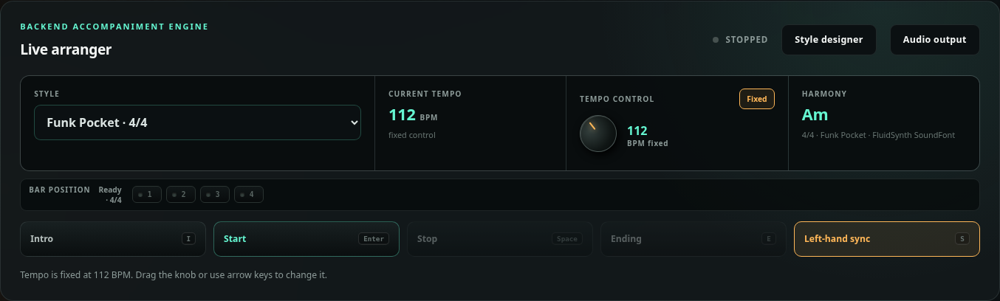
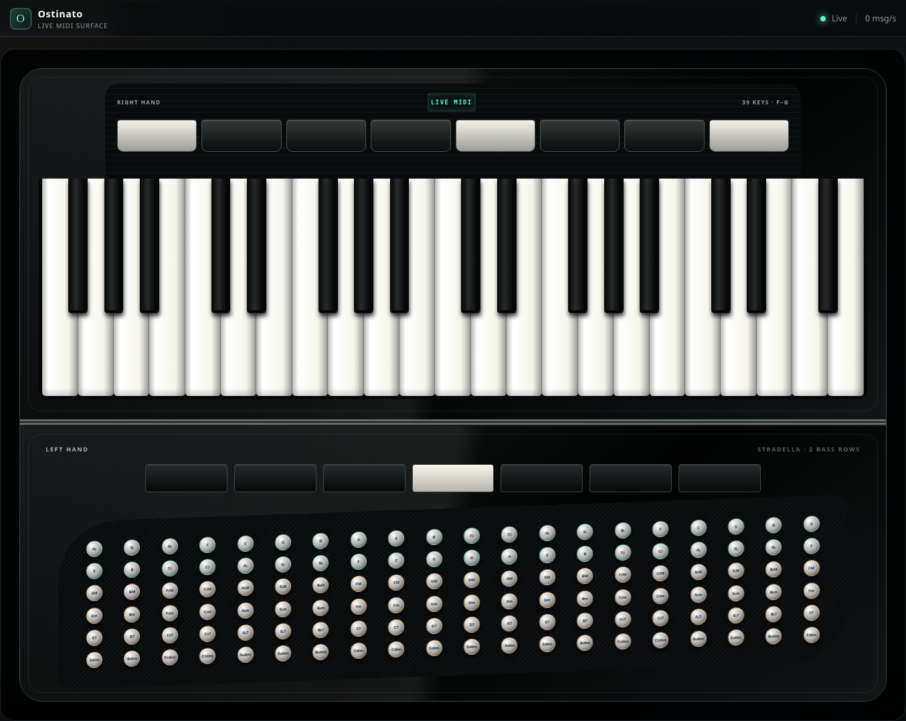
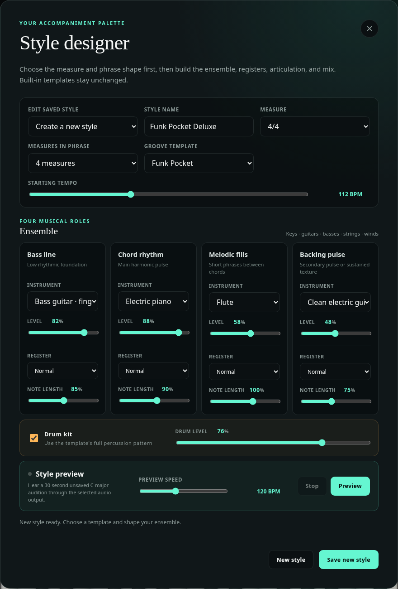

# Ostinato

**A real-time accompaniment engine and visual performance surface for the
Roland FR-4X V-Accordion.**

Ostinato listens to the accordion's MIDI performance, predicts harmony from
bass and melody before confirming it from the chord button, follows or fixes
the left-hand tempo, and renders a complete backing ensemble through a selected
host audio output. The browser shows the 39-key piano side and the 120-button,
two-bass-row Stradella side as they are played.

The accordion's own sound never passes through the software. Its analog output
stays connected directly to the mixer; Ostinato supplies accompaniment audio on
a separate channel.



## What it can do

- Detect treble, bass, and chord MIDI channels through a guided setup wizard—no
  FR-4X channel defaults are guessed.
- Animate a responsive 39-key F-to-G piano and 120-button Stradella surface in
  real time.
- Recognize major, minor, dominant-seventh, and diminished harmony, including
  documented FR-4X D-Mode chord codes.
- Apply a low-latency provisional harmony from bass, melody, meter, and the last
  confirmed chord, then correct it as soon as the chord button arrives.
- Follow tempo from combined bass and chord attacks with outlier rejection, or
  lock an exact tempo from 40–240 BPM.
- Start a main section, play a style-shaped four-bar intro, trigger either of
  two next-measure Fill Ins, queue a four-bar ending, or use left-hand
  start/stop sync.
- Learn exact MIDI messages from six accordion function switches so Intro,
  Fill In 1/2, Ending, Start, and Stop do not require the browser during a
  performance.
- Show a compact meter-aware beat indicator for 2/4, 3/4, and 4/4 styles.
- Render all fourteen built-ins through genre-profiled sfizz racks of open
  multi-sampled piano, guitars, upright/electric basses, orchestral voices, and
  live drums/percussion; 105 deduplicated host-local KORG imports and custom
  styles use FluidSynth with the MuseScore General HQ General MIDI
  approximation.
- Build, preview, save, reopen, update, and delete custom styles without a
  frontend build tool or database.
- Play accompaniment through direct ALSA hardware or host PipeWire sinks,
  including connected Bluetooth audio.
- Run as a reproducible Docker service with persistent setup and style state.

## The virtual accordion

The right-hand projection uses the performer-observed 39-key F-to-G shape. The
left-hand surface models the FR-4X standard **2 Bass Rows** layout: counterbass,
fundamental bass, major, minor, seventh, and diminished rows across twenty
circle-of-fifths columns. It is intentionally not presented as free bass.



MIDI pitch alone cannot always distinguish the two physical bass rows. When a
standalone note could come from either fundamental or counterbass, the UI marks
both candidates. Once a chord establishes context, the display can resolve a
major-third counterbass relationship without pretending the instrument sent a
button identity that it did not send.

## Signal flow

```text
                            MIDI only
FR-4X USB COMPUTER ─────────────────────────► Linux host / Docker
                                                     │
                                                     │ accompaniment audio
                                                     ▼
FR-4X analog OUTPUT ─────────────► mixer ◄──── audio interface / Bluetooth
                                    │
                                    ▼
                              PA / headphones
```

Keeping the two audio paths separate is a safety feature: if the browser,
container, synth, or laptop stops, the performer still has the accordion's
direct analog voice.

## Built-in style library

Every built-in style has a varying four-bar main phrase, a section-specific
four-bar intro and ending, two one-bar Fill Ins, phrase dynamics, bass movement,
comping, melodic answers, and percussion appropriate to its meter.

| Style | Meter | Default | Character |
| --- | ---: | ---: | --- |
| Modern Tango | 4/4 | 120 BPM | Dramatic 3+3+2 foundation |
| Classic Tango | 4/4 | 120 BPM | Marcato and sincopa without a generic kit |
| Classic Waltz | 3/4 | 96 BPM | Open multi-sample orchestra; bass-on-one, chords on two and three |
| Bossa Nova | 4/4 | 116 BPM | Relaxed syncopation and cross-stick pulse |
| Swing Foxtrot | 4/4 | 132 BPM | Walking bass and swung ride feel |
| Alpine Polka | 2/4 | 124 BPM | Alternating bass and lively offbeats |
| Motown Soul | 4/4 | 104 BPM | Melodic bass, backbeat, tambourine lift |
| Funk Pocket | 4/4 | 112 BPM | Tight syncopation and ghost-note dynamics |
| Soft Pop Ballad | 4/4 | 83 BPM | Spacious acoustic ensemble |
| Country Two-Step | 4/4 | 114 BPM | Train beat and alternating bass |
| Reggae One Drop | 4/4 | 84 BPM | Deep bass and clipped offbeat guitar |
| Brazilian Samba | 4/4 | 110 BPM | Layered pulse and bright percussion |
| New Orleans Cha-Cha | 4/4 | 124 BPM | Tumbao-shaped bass and claves |
| Blues Shuffle | 4/4 | 112 BPM | Rolling triplets and turnaround fills |

The eight human-groove adaptations reference Google's CC BY 4.0 Groove MIDI
Dataset. Exact source performances, transformations, and the libraries that
were evaluated but not bundled are documented in
[Style library sources and licensing](docs/style-library-sources.md).

## Style designer

The designer combines a meter-compatible groove template with four musical
roles: bass line, chord rhythm, melodic fills, and backing pulse. Each role has
its own instrument, level, register, and note length. Drums have an independent
enable and level control.

A five-lane arrangement timeline shows the selected instrument and level for
each role, its exact onset density, note lengths, accents, phrase dynamics, and
measure boundaries. It updates immediately while editing. The main arranger
shows the same model with a real-time playhead synchronized to backend musical
ticks.



The instrument catalog includes pianos, acoustic and electric guitars, several
basses, mandolin-style pluck, orchestral strings, harp, and woodwinds. Unsaved
styles can be previewed in C major at an independent speed. Instrument, mix,
register, articulation, phrase, template, and drum changes automatically
restart an active preview after a short debounce.

Custom styles are validated and written atomically. They keep the selected
built-in template's arranged intro and ending while allowing a one-to-four-bar
main loop.

## Quick start with Docker

### Requirements

- A native Linux Docker Engine with the Compose plugin. Docker Desktop on macOS
  or Windows cannot use the Linux USB/ALSA mappings in `compose.yaml` as written.
- A logged-in PipeWire desktop session for desktop or Bluetooth audio.
- A data-capable USB cable from the FR-4X **USB COMPUTER** port.
- The accordion's `USB Drv` setting set to `Generic`, followed by a power cycle.

From the repository root:

```bash
docker compose up --build --detach
docker compose ps
```

Open <http://127.0.0.1:8765>. The service binds only to loopback by default.

Compose expects `XDG_RUNTIME_DIR` to point to the current desktop session so it
can mount that session's `pipewire-0` socket. Run the command as the logged-in
desktop user, not through `sudo`.

Stop the service without deleting saved setup:

```bash
docker compose down
```

`docker compose down --volumes` also removes the saved MIDI profile, selected
audio output, and custom styles.

### First-run workflow

1. Choose **Set up MIDI**.
2. Select the exact FR-4X input and, optionally, an output used only by browser
   simulator presses.
3. Follow the guided captures for the treble, bass, and chord roles.
4. Review the observed channel candidates and save the profile.
5. Choose **Performance controls**, learn the desired accordion function
   switches, and save them with the exact input profile.
6. Choose **Audio output**, select an exact PipeWire or ALSA route, play the
   bounded test chord, and save it.
7. Select a style, choose fixed or left-hand tempo, and start playing.

Saved device names are restored only when the exact devices are available.
Ostinato never silently substitutes another MIDI port or audio sink.

### Performance controls

| Control | Keyboard | Action |
| --- | --- | --- |
| Intro | `I` | Start or arm the four-bar intro |
| Start | `Enter` | Start the main phrase from bar one |
| Stop | `Space` | Stop accompaniment immediately |
| Ending | `E` | Enter the ending at the next bar |
| Fill In 1 | `1` | Play the rhythmic lift in the next complete bar |
| Fill In 2 | `2` | Play the turnaround in the next complete bar |
| Left-hand sync | `S` | Toggle activity-based start and stop |

Shortcuts are ignored while a form field or dialog has focus.

After saving the MIDI profile, **Performance controls** can learn an exact raw
MIDI message or short message sequence for each of the six section actions.
Learning never assumes an FR-4X channel or proprietary control encoding. Notes,
pressure, pitch bend, clock, active sensing, and bellows expression CC11 are
excluded, and the learned controls run in the backend even if the browser is
reloaded. Re-running MIDI setup for a different input clears the bindings;
re-running it for the same exact input preserves them.

## Host development

Python 3.12 and Pipenv are required:

```bash
export PIPENV_VENV_IN_PROJECT=1
pipenv sync --dev
pipenv run ostinato --help
pipenv run ostinato doctor
pipenv run scripts/run-checks.sh
```

Run the web application without Docker:

```bash
pipenv run ostinato web
```

The `doctor` command is read-only. It reports Python, MIDI, ALSA, PipeWire, and
FluidSynth readiness without installing packages or changing the machine.

A hardware-free keyboard harness is available for deterministic chord and
renderer checks:

```bash
pipenv run ostinato keyboard --keys 'zagxgq'
pipenv run ostinato keyboard --play
```

The complete check suite runs Python tests, browser JavaScript tests, Ruff
format/lint, and strict mypy. Hardware boundaries are injected or faked; a
passing suite does not claim that an FR-4X or physical audio route was tested.

## Architecture

```text
MIDI callback
    │ timestamp + normalize
    ▼
bounded backend queues ───────────────► WebSocket visualization
    │
    ▼
bass/chord clustering + tempo tracker
    │
    ▼
backend arranger state
    │ style + section + harmony + integer musical ticks
    ▼
FluidSynth event planner
    │
    ▼
explicit PipeWire/ALSA PCM sink
```

The browser is a controller and best-effort monitor, not the accompaniment
scheduler. Arranger state and audio ownership remain in the backend, so a page
reload does not stop a running performance. A preview has a 30-second backend
deadline so an abandoned browser cannot leave it playing forever.

Main modules:

| Path | Purpose |
| --- | --- |
| `src/ostinato/web_server.py` | FastAPI API, WebSocket, application lifecycle |
| `src/ostinato/realtime_midi.py` | MIDI discovery, input, simulator output |
| `src/ostinato/midi_detection.py` | Guided role detection |
| `src/ostinato/arranger.py` | Harmony, tempo, transport, sync, preview |
| `src/ostinato/computer_audio.py` | Style vocabulary, PCM sink, fallback synth |
| `src/ostinato/soundfont_audio.py` | FluidSynth event rendering |
| `src/ostinato/audio_output.py` | PipeWire/ALSA discovery and testing |
| `src/ostinato/style_designer.py` | Custom-style schema and persistence |
| `src/ostinato/web_static/` | Native Web Components and responsive UI |

There is no frontend compilation step and no database.

## Persistent state

By default, host development writes to
`~/.local/state/ostinato`. Docker sets `OSTINATO_STATE_DIRECTORY` to the
Compose-managed `/var/lib/ostinato` volume. The service stores:

- `midi-profile.json` — reviewed ports and detected roles;
- `audio-output.json` — one explicitly tested output identifier; and
- `custom-styles.json` — versioned user-created styles.

Do not commit machine-specific copies of these files.

## Security and current limits

- The web service has no authentication or TLS. Keep the default loopback bind
  unless a separate trusted-network boundary is in place.
- Compose grants the container access to `/dev/snd` and the host USB device
  filesystem. It is not privileged, but raw USB access is still broad.
- The optional MIDI output is only for browser-surface notes. Accompaniment is
  audio; it is not sequenced back into the accordion.
- Physical latency, reconnect endurance, and musical feel remain hardware and
  performer acceptance gates—not conclusions inferred from browser timing.
- Standard two-bass-row Stradella is supported. Three-bass-row and free-bass
  layouts need explicit geometry and transmission evidence before display.

## Documentation

- [Architecture and timing boundaries](docs/architecture.md)
- [Physical USB and audio connections](docs/connections.md)
- [Docker, USB, ALSA, PipeWire, and Bluetooth](docs/docker.md)
- [Complete web-interface behavior](docs/web-interface.md)
- [Pipenv development workflow](docs/development.md)
- [Computer-only testing](docs/computer-only-testing.md)
- [Style sources and licenses](docs/style-library-sources.md)
- [Local KORG style import workspace](assets/styles/korg/README.md)
- [Current live KORG library evidence](docs/evidence/w42-korg-library-groups-and-deduplication.md)
- [Style-pack evidence and provenance boundary](docs/evidence/w25-licensed-groove-style-pack.md)

## License

Project code is available under the [MIT License](LICENSE). Distributed or
system-provided musical assets retain their own licenses; see
[style-library-sources.md](docs/style-library-sources.md) and the package
metadata described in [docs/docker.md](docs/docker.md).
